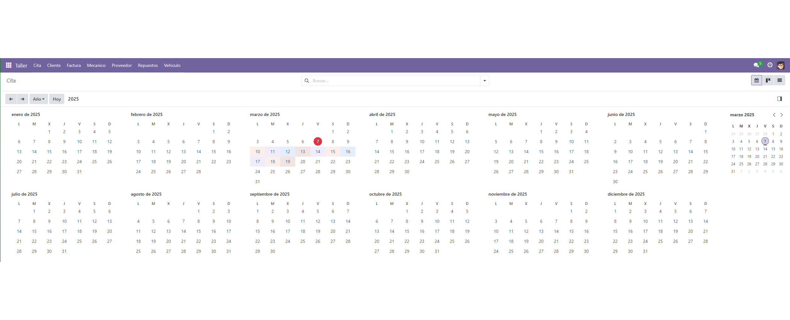
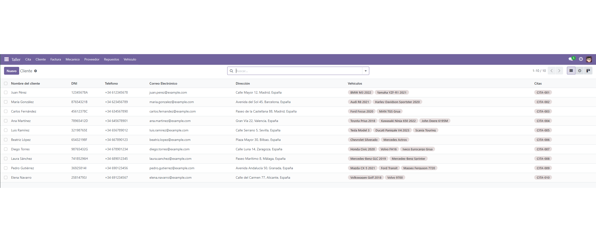
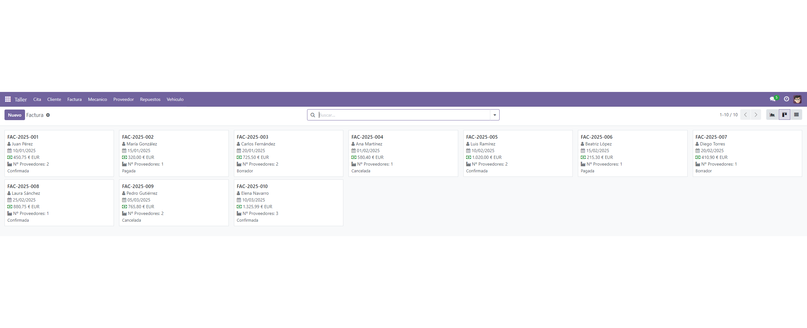
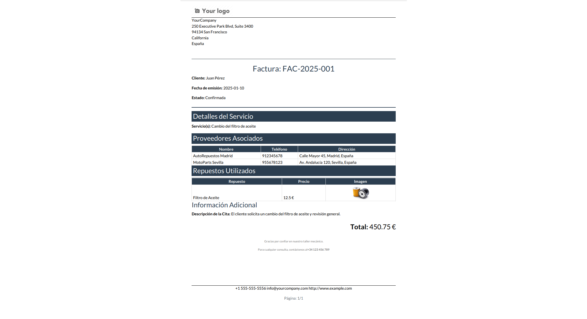
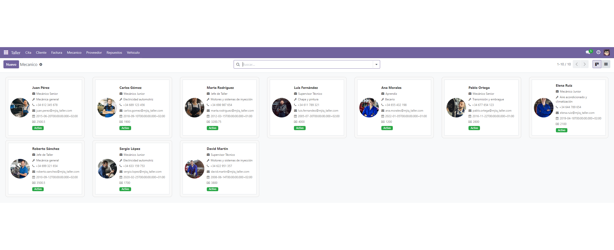
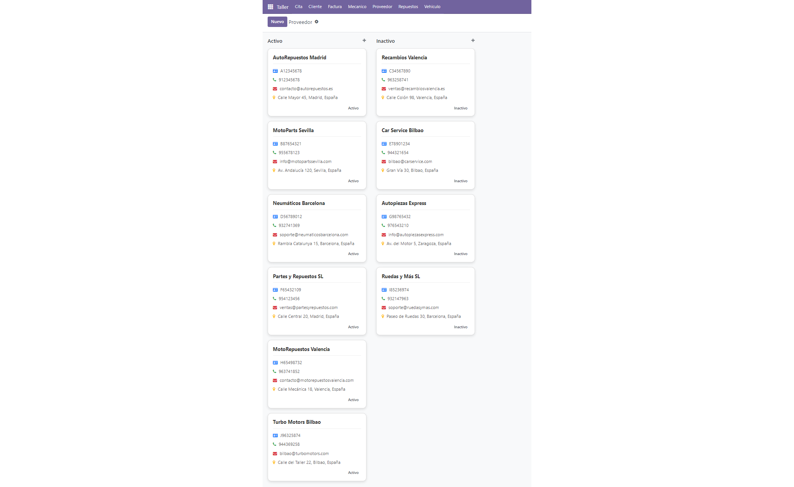
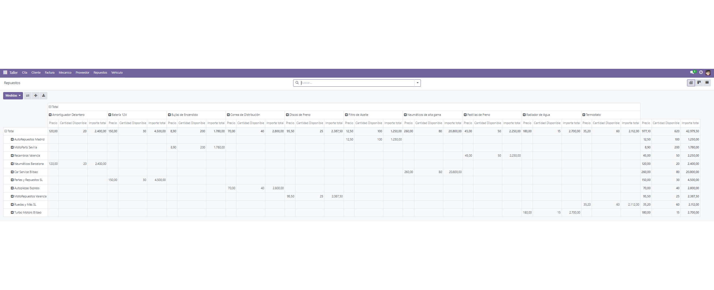
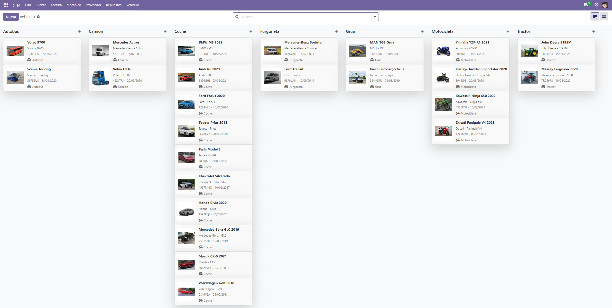

# Módulo de Taller Mecánico para Odoo

Gestione su taller mecánico de manera eficiente con este módulo para Odoo. Permite administrar clientes, vehículos, citas, facturas, mecánicos, proveedores y repuestos, facilitando la operación y facturación del taller.

---

## Tabla de Contenidos

- [Introducción](#introducción)
- [Requisitos Previos](#requisitos-previos)
- [Estructura del Proyecto](#estructura-del-proyecto)
- [Instalación](#instalación)
- [Configuración y Uso](#configuración-y-uso)
- [Capturas de Pantalla](#capturas-de-pantalla)
- [Contribuciones](#contribuciones)
- [Licencia](#licencia)

---

## Introducción
Este módulo ha sido diseñado para facilitar la gestión de un taller mecánico mediante Odoo. Ofrece funcionalidades clave como:

- Registro de clientes y vehículos.
- Creación y administración de citas.
- Control de repuestos y proveedores.
- Facturación automatizada.
- Dashboard para monitoreo de actividades.

---

## Requisitos Previos

| Requisito        | Versión Recomendada |
|------------------|---------------------|
| Odoo            | 17          |
| Python          | 3.x                  |
| PostgreSQL      | 12 o superior        |
| Docker o Docker Desktop | Para despliegue con `docker-compose` |

Además, es recomendable instalar las siguientes extensiones en Visual Studio Code:

- `jigar-patel.OdooSnippets`
- `ms-python.python`
- `ms-azuretools.vscode-Docker`
- `ckolkman.vscode-postgres`

---

## Estructura del Proyecto

```plaintext
odoo/addons/mjiq_taller/
├── demo/                    # Datos de demostración
├── i18n/                    # Archivos de traducción
├── models/                  # Modelos de datos (Cliente, Vehículo, Cita, Factura...)
├── reports/                 # Plantillas de informes (Factura)
├── security/                # Permisos y grupos de usuario
├── static/                  # Recursos estáticos (iconos, imágenes de demo)
├── views/                   # Vistas XML para formularios, listas, menús...
├── __init__.py              # Importaciones de modelos
└── __manifest__.py          # Metadatos del módulo
odoo/
├─ config/                   # Configuración de Odoo

├ pgadmin4/                  # Configuración de pgAdmin

├ docker-compose.yml         # Para despliegue con Docker
├ set_permissions.sh         # Script de permisos

```

---

## Instalación

### Odoo Local

1. Clonar el repositorio en la carpeta de módulos de Odoo:
   ```sh
   git clone https://github.com/tu-usuario/nombre-del-repo.git
   ```
2. Dar permisos con el fichero de set_permissions.sh:
   ```sh
   chmod +x set_permissions.sh
   ./set_permissions.sh
   ```
3. Reiniciar el servidor de Odoo:
   ```sh
   sudo systemctl restart odoo
   ```
4. Activar el modo desarrollador en Odoo.
5. Ir a **Aplicaciones**, buscar el módulo e instalarlo.

### Docker

1. Clonar el repositorio y acceder a la carpeta:
   ```sh
   git clone https://github.com/tu-usuario/nombre-del-repo.git
   cd nombre-del-repo
   ```
2. Levantar los contenedores:
   En caso de usar Linux:
   ```sh
   docker-compose up
   ```
  En caso de usar Windows:
  1. Abrir Docker Desktop
  2. Abre el terminal de Docker Desktop
  3. Dirijete hasta la ruta donde este el docker-compose.yml
  4. Ejecuta este comando:
  ```sh
   docker-compose up
  ```
3. Acceder a Odoo en `http://localhost:8069` y crear una base de datos.

---

## Configuración y Uso

1. Acceder al módulo desde el panel de Odoo.
2. Configurar clientes y vehículos desde el menú correspondiente.
3. Crear citas para reparaciones.
4. Gestionar el inventario de repuestos y proveedores.
5. Controlar los empleados del taller (Mecánicos).
6. Generar facturas automáticas tras la finalización de trabajos.

---

# Capturas de Pantalla
## Sección de Citas:

## Sección de Clientes:

## Sección de Facturas:

### Impresión de facturas en pdf:

## Sección de Mecanicos:

## Sección de Proveedores:

## Sección de Repuestos:

## Sección de Vahiculos:


---

## Contribuciones

Si deseas contribuir al desarrollo del módulo:
1. Realiza un **fork** del repositorio.
2. Crea una rama con tu mejora: `git checkout -b feature/nueva-funcionalidad`
3. Sube tus cambios y crea un **pull request**.

---

## Licencia

Este proyecto está licenciado bajo la MIT License - ver el archivo [LICENSE](LICENSE) para más detalles.

